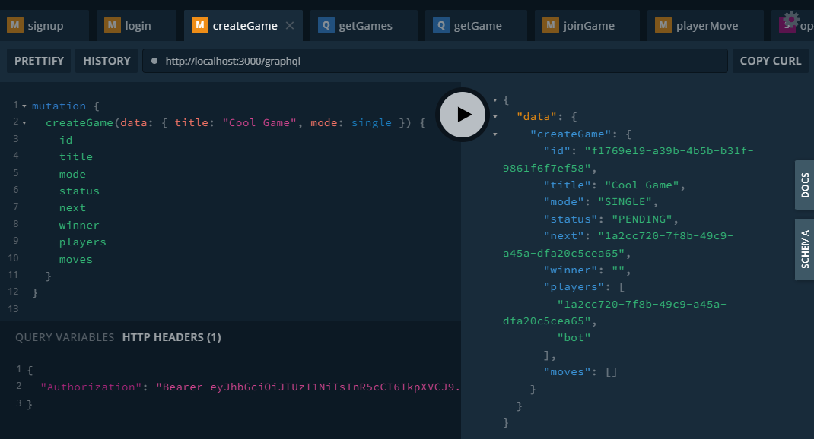

# Tic-Tac-Toe

Apollo GraphQL + NestJS

## Getting Started

- Clone the repository `https://github.com/alireza-haddadi/tic-tac-toe-gql-nestjs.git`.
- Install dependencies `npm install`.
- Run `cp .env.example .env` and edit it with your secret phrase.
- Run `npm start`.
- Visit `http://localhost:3000/graphql` for GraphQL playground.

## API summary

| Name         | Type         |         Protected         |
| :----------- | :----------- | :-----------------------: |
| signup       | mutation     |            No             |
| login        | mutation     | Yes ( usernam, password ) |
| createGame   | mutation     |        Yes ( jwt )        |
| getGames     | query        |        Yes ( jwt )        |
| getGame      | quey         |        Yes ( jwt )        |
| joinGame     | mutation     |        Yes ( jwt )        |
| playerMove   | mutation     |        Yes ( jwt )        |
| newMove      | subscription |            No             |

## Notes

- Altair client is accessible at `http://localhost:3000/altair/`.
- Log files will be created in the root directory - `gql-request-log.log` and `gql-error-log.log`. Each line in log files starts with an uuid which is generated and assigned to the request in the [`LoggingPlugin`](https://github.com/alireza-haddadi/tic-tac-toe-gql-nestjs/blob/42af71bcad2c52d7936298fdb10f609fc6776228/src/common/plugins/logging.plugin.ts#L14).
- Since this repo serves a demo purpose:
  1. Instead of a real persistance ORM, data are stored in an in-memory map object in the [`StorageService`](https://github.com/alireza-haddadi/tic-tac-toe-gql-nestjs/blob/42af71bcad2c52d7936298fdb10f609fc6776228/src/storage/storage.service.ts#L4).
  2. Passwords are stored as plain texts.
  3. Token refreshment scenario is not implemented.
- `newMove` subscription is not protected by JWT gaurd. To do that at this moment, the context object of Apollo server should be modified significantly which is not within the scope of this challenge.
- By providing `gameId` argument for `newMove` subscription, it will get events only for that specific game.
- Below user and game objects are hardcoded into the storage map.

```
{
  id: 'e63afa5d-ecfe-4105-8d58-62gggf378301',
  firstname: "Alireza",
  lastname: "Haddadi",
  username: 'alireza',
  password: '123456',
  type: 'user'
}

{
  id: '838dc064-c528-4391-a0df-b2d7adb6493b',
  title: 'First Game',
  mode: GameMode.single,
  status: GameStatus.pending,
  next: '',
  winner: '',
  players: ['e63afa5d-ecfe-4105-8d58-62gggf378301', 'bot'],
  moves: [],
  type: 'game'
}
```

## Screenshots





